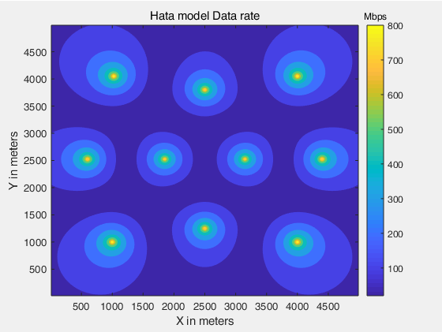
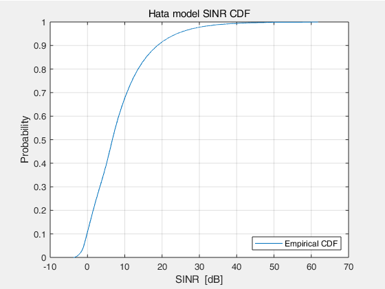
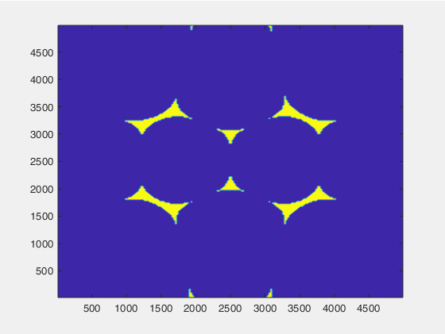
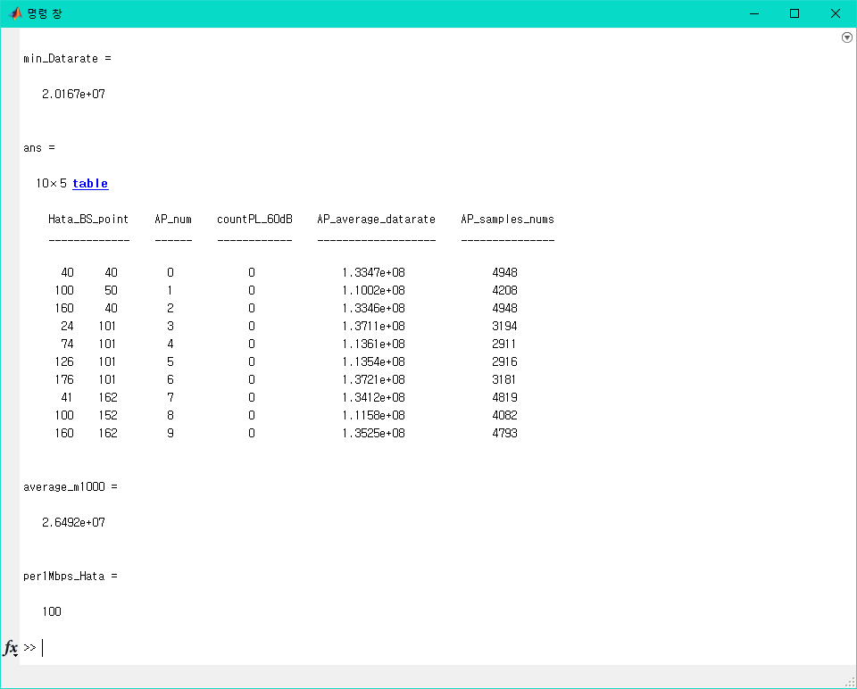

# Plotting datarate
+ Use Hata model for Pathloss.
+ 5x5 km toymodel (get 40000 samples for data)
+ 10 basestation (each basestation has 49 dBm TX power)


* * *
+ 2019.11.17. : Upload
* * *


## Result Figures
> contourf()<br/>
</img><br/>

> SINR CDF by 40000 samples<br/>
</img><br/>

> datarate 하위 1000개 samples position<br/>
</img><br/>

> Result Table<br/>
</img><br/>


## Code
> datarate_Hata.m
```matlab
%% Lu175
% Hata model Data rate
% use common parameter & model

clc; close all; clear all;          % 작업 공간 초기화

%% Number of Base Station
BSn = 10;

%% Base Station Coordinates  [CHANGE]
% 사선
% BS = [ 43 149;  110 169; ...
%        90 121;  150 119; ...
%        49  81;  107  79; ...
%        89  33;  157  51; ...
%        20  18;  181 183];

% 3-4-3
% BS = [ 50  50;  100  50;  150  50; ...
%        24 101;   74 101;  126 101;  176 101; ...
%        51 152;  100 152;  150 152];
  
% 육각형
% BS = [ 60  30;  141  30;   25 100;  175 100;   60 175;  141 175;...
%        80  80;  120  80;   80 120;  120 120];


% 박재현
% 3-4-3
BS = [ 40  40;  100  50;  160  40; ...
       24 101;   74 101;  126 101;  176 101; ...
       41 162;  100 152;  160 162];
    % 하위 1000개 평균 = 27.900 Mbps

%% Global variables
Ptx = 49;              % dBm
BW_hata = 4.0e7;       % Hz  (40 MHz)
countPL_60dB = [0 0 0 0 0 0 0 0 0 0];

setGlobalx(Ptx, BW_hata);
setCount(countPL_60dB);

%% Logic
[X, Y] = meshgrid(12.5: 25: 4987.5);

d = zeros(200, 200, BSn);
SINR = zeros(200, 200);
allHome_idx = zeros(200, 200);
oneHome_val_sum = zeros(1, BSn);
oneHome_idx_nums = zeros(1, BSn);
Distance = @distance;
SINR_hata = @SINR_Calc_hata;
X_C = @x_Convert;
Y_C = @y_Convert;

for i = 1:BSn
    d(:, :, i) = Distance(X, Y, i, BS);
end


for xi = 1:200
    for yi = 1:200
        d_point = d(xi, yi, :);
        [home_val, home_idx] = min(d_point);
        allHome_idx(xi, yi) = home_idx;
        SINR(xi, yi) = SINR_hata(d_point, home_val, home_idx, BSn);
        
        oneHome_val_sum(1, home_idx) = oneHome_val_sum(1, home_idx) + ( BW_hata * log2(1 + SINR(xi, yi)) );
        oneHome_idx_nums(1, home_idx) = oneHome_idx_nums(1, home_idx) + 1;
    end
end

SINR_dB = 10*log10(SINR);
buffer_s = [];
for i = 1:200
    buffer_s = [buffer_s, SINR_dB(i, :)];
end

DatarateSC = BW_hata * log2(1 + SINR);
buffer_d = [];
for i = 1:200
    buffer_d = [buffer_d, DatarateSC(i, :)];
end
min1000_samples = mink(buffer_d, 1000);
min_Datarate = min(buffer_d)


Hata_BS_point = BS;
AP_num = [0:9]';
countPL_60dB = getCount';
AP_average_datarate = (oneHome_val_sum ./ oneHome_idx_nums)';
AP_samples_nums = oneHome_idx_nums';

table(Hata_BS_point, AP_num, countPL_60dB, AP_average_datarate, AP_samples_nums)

average_m1000 = sum(min1000_samples, 'all')/1000

ref = 1.0e6;
num1Mbps = 0;
for xi = 1:200
    for yi = 1:200
        if DatarateSC(xi, yi) >= ref
            num1Mbps = num1Mbps + 1;
        end
    end
end
per1Mbps_Hata = num1Mbps/400      % data rate가 1 Mbps 이상인 곳의 백분율

%% Plotting
% figure(1);
% contourf(X, Y, SINR_dB,'LineStyle', 'none');
% hold on;
% 
% title('Hata Model SINR');
% xlabel('X in meters');
% ylabel('Y in meters');
% cbar1 = colorbar;
% title(cbar1, 'dB');


figure(2);
contourf(X, Y, DatarateSC/(10^6), 'LineStyle', 'none');
hold on;

title('Hata model Data rate');
xlabel('X in meters');
ylabel('Y in meters');
cbar2 = colorbar;
title(cbar2, 'Mbps');


figure(3);
cdfplot(buffer_s);
hold on;
legend('Empirical CDF', 'Location', 'SouthEast');
title('Hata model SINR CDF');
xlabel('SINR  [dB]');
ylabel('Probability');


for xi = 1:200
    for yi = 1:200
        for k = 1:1000
            if DatarateSC(xi, yi) == min1000_samples(k)
                DatarateSC(xi, yi) = 10^20;
            end
        end
    end
end
figure(4);
contourf(X, Y, DatarateSC/(10^6), 'LineStyle', 'none');

%% Function
function y = distance(X, Y, i, BS)
xPoint(i) = 25 * BS(i, 1);
yPoint(i) = 25 * BS(i, 2);
d_all = sqrt((X - xPoint(i)).^2 + (Y - yPoint(i)).^2);      % m

y = d_all;
end


function y = SINR_Calc_hata(MAT, HomeAP_val, HomeAP_idx, BSn)
% Global Variables %%%%%%%%%%%%%%%%%%%%%%%%%%%%%%%%%%%%%%%%%%%%%%%%%%%%%%%%%%%%%%%%%%%%%%%%%%%%%%%%%
Ptx = getGlobalx1;     % dBm
BW_hata = getGlobalx2; % MHz
countPL_60dB = getCount;
%%%%%%%%%%%%%%%%%%%%%%%%%%%%%%%%%%%%%%%%%%%%%%%%%%%%%%%%%%%%%%%%%%%%%%%%%%%%%%%%%%%%%%%%%%%%%%%%%%%%

% Variables %%%%%%%%%%%%%%%%%%%%%%%%%%%%%%%%%%%%%%%
f_hata = 850;          % MHz
ht = 40;               % m
hr = 2;                % m
Gt = 6;                % dBi
Gr = 0;                % dBi
C_loss = 3;            % dB  (Cable loss)
B_loss = 0;            % dB  (Body loss)
s = 8.2;               % dB  (Shadowing effect)
%%%%%%%%%%%%%%%%%%%%%%%%%%%%%%%%%%%%%%%%%%%%%%%%%%

k = 1.38*10^(-23);                        %볼츠만상수[J/K]
T = 295;                                  %실온의 절대온도[K]
%Noise Power
N_hata = k*T*BW_hata*(10^3);

PLh_home_dB = 69.55 + 26.16*log10(f_hata) - 13.82*log10(ht) ...
    - (3.2*(log10(11.75*hr))^2 - 4.97) + (44.9 - 6.55*log10(ht))*log10(HomeAP_val/1000);        % HomeAP_val/1000 -> [km]
if PLh_home_dB <= 60
    countPL_60dB(HomeAP_idx) = countPL_60dB(HomeAP_idx) + 1;
    setCount(countPL_60dB);
    PLh_home_dB = 60;
    Prx_home_dBm = Ptx - PLh_home_dB + Gr + Gt - C_loss - B_loss;
    % Prx_home_dBm = Ptx(HomeAP_idx) - PLh_home_dB + Gr + Gt - C_loss - B_loss;
else
    Prx_home_dBm = Ptx - PLh_home_dB + Gr + Gt - C_loss - B_loss - s;
    % Prx_home_dBm = Ptx(HomeAP_idx) - PLh_home_dB + Gr + Gt - C_loss - B_loss - s;
end

Prx_home_mW = 10.^(Prx_home_dBm/10);

PLh_neigh_dB = zeros(1, BSn);
Prx_neigh_dBm = zeros(1, BSn);
for i = 1:BSn
    if i ~= HomeAP_idx
        PLh_neigh_dB(i) = 69.55 + 26.16*log10(f_hata) - 13.82*log10(ht) ...
            - (3.2*(log10(11.75*hr))^2 - 4.97) + (44.9 - 6.55*log10(ht))*log10(MAT(i)/1000);
        if PLh_neigh_dB(i) <= 60
            PLh_neigh_dB(i) = 60;
        end
        
        Prx_neigh_dBm(i) = Ptx - PLh_neigh_dB(i) + Gr + Gt - C_loss - B_loss - s;
    end
    % Prx_neigh_dBm(HomeAP_idx)의 값이 '0 dBm'
end

Prx_neigh_mW = 10.^(Prx_neigh_dBm./10);     % Prx_neigh_mW(HomeAP_idx)의 값이 '1 mW'
Prx_neigh_sum_mW = 0;
for i = 1:BSn
    if i ~= HomeAP_idx
        Prx_neigh_sum_mW = Prx_neigh_sum_mW + Prx_neigh_mW(i);
    end
end

y = Prx_home_mW ./ (N_hata + Prx_neigh_sum_mW);
end


function y = x_Convert(X)
X_converted = zeros(1, length(X(1,:)));
for i = 1:length(X(1,:))
    X_converted(i) = (((X(1,i)./12.5) -1) ./2) +1;
end

y = X_converted;
end


function y = y_Convert(Y)
Y_converted = zeros(1, length(Y(:,1)));
for i = 1:length(Y(:,1))
    Y_converted(i) = (((Y(i,1)./12.5) -1) ./2) +1;
end

y = Y_converted';
end

%% Function for global variables
function setGlobalx(val1, val2)
global x1 x2
x1 = val1;
x2 = val2;
end

function r = getGlobalx1
global x1
r = x1;
end

function r = getGlobalx2
global x2
r = x2;
end


function setCount(val1)
global count
count = val1;
end

function r = getCount
global count
r = count;
end

```

